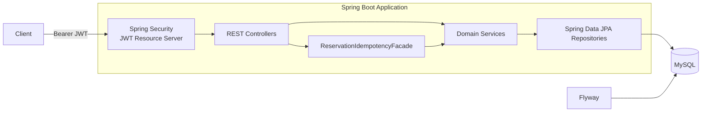
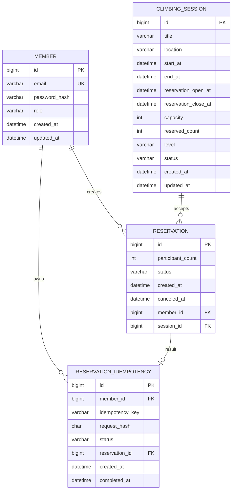

# CruxMate

제한된 정원의 클라이밍 세션에서 **동시 예약과 중복 요청을 안전하게 처리하는 예약 백엔드 API**입니다.

단순 CRUD보다 예약 과정에서 발생할 수 있는 데이터 정합성 문제를 해결하는 데 집중했습니다.

- 마지막 남은 자리에 여러 요청이 동시에 접근하는 경우의 정원 초과 방지
- 네트워크 재시도·중복 클릭에 따른 중복 예약 방지
- 동일 예약의 동시 취소에 따른 예약 인원 중복 감소 방지
- JWT 기반 사용자 식별과 예약 소유권 검증

---

## 핵심 기능

### 회원·인증

- 이메일 기반 회원가입
- BCrypt 비밀번호 해싱
- 이메일·비밀번호 로그인
- HS256 JWT Access Token 발급
- Stateless 인증
- USER·ADMIN 역할 기반 API 접근 제어

### 클라이밍 세션

- 관리자 세션 생성
- 세션 단건 조회
- 예정된 세션 목록 조회
- 페이지네이션 지원
- 예약 기간·정원·난이도 검증

### 예약

- 예약 생성
- 내 예약 목록 조회
- 본인 예약 취소
- 비관적 락 기반 정원 보호
- Idempotency-Key 기반 중복 요청 방지
- 동일 키 동시 요청의 UNIQUE 충돌 복구

---

## 기술 스택

| 구분 | 기술 |
|---|---|
| Language | Java 21 |
| Framework | Spring Boot 4.1.0 |
| Web | Spring Web MVC |
| Persistence | Spring Data JPA, Hibernate |
| Security | Spring Security, OAuth2 Resource Server, JWT |
| Database | MySQL |
| Migration | Flyway |
| Test | JUnit 5, AssertJ, Mockito, MockMvc |
| Integration Test | Testcontainers MySQL |
| Build | Maven Wrapper |
| CI | GitHub Actions |

---

## 아키텍처



예약 생성 요청은 JWT 인증을 통과한 뒤 멱등성 Facade를 거쳐 처리됩니다.  
멱등성 기록과 실제 예약 생성은 Service 계층에서 처리하고, 세션 정원 변경은 MySQL의 비관적 락을 이용해 보호합니다.

---

## 데이터 모델



주요 데이터베이스 제약:

- `member.email` UNIQUE
- `(member_id, idempotency_key)` 복합 UNIQUE
- `reservation_id` UNIQUE
- `capacity > 0`
- `0 <= reserved_count <= capacity`
- `1 <= participant_count <= 4`

---

## 핵심 설계

### 1. 비관적 락을 이용한 동시 예약 정원 보호

#### 문제

두 요청이 동시에 같은 세션의 잔여 정원을 읽으면 둘 다 예약 가능하다고 판단할 수 있습니다.

```text
요청 A: 잔여 정원 확인 → 예약 가능
요청 B: 잔여 정원 확인 → 예약 가능
요청 A: reservedCount 증가
요청 B: reservedCount 증가
```

애플리케이션 수준의 단순 조회와 수정만으로는 정원 초과를 막을 수 없습니다.

#### 해결

예약 생성 시 세션을 `PESSIMISTIC_WRITE`로 조회합니다.

```java
@Lock(LockModeType.PESSIMISTIC_WRITE)
Optional<ClimbingSession> findByIdForUpdate(Long sessionId);
```

정원 확인, `reservedCount` 증가, 예약 저장을 하나의 트랜잭션에서 처리합니다.  
먼저 락을 획득한 요청이 완료될 때까지 다른 요청은 대기하고, 갱신된 정원을 기준으로 다시 검증합니다.

#### 검증

정원 1명인 세션에 두 회원이 동시에 예약하도록 실행해 다음을 확인했습니다.

- 성공 요청 1건
- 정원 초과 실패 1건
- 예약 1건 생성
- 최종 `reservedCount = 1`

관련 코드:

- `ClimbingSessionRepository.findByIdForUpdate()`
- `ReservationService.createReservation()`
- `ReservationConcurrencyTest`

---

### 2. Idempotency-Key 기반 중복 예약 방지

#### 문제

클라이언트가 응답을 받지 못해 같은 요청을 재시도하거나 사용자가 버튼을 여러 번 누르면 예약이 중복 생성될 수 있습니다.

#### 해결

예약 생성 API는 `Idempotency-Key`를 필수로 받고 다음 정보를 저장합니다.

- 회원 ID
- Idempotency-Key
- 요청 해시
- 처리 상태
- 생성된 예약 ID

요청 해시는 다음 값으로 생성합니다.

```text
memberId:sessionId:participantCount
```

동일 키와 동일 요청이 다시 들어오면 새 예약을 만들지 않고 기존 예약 ID를 반환합니다.  
같은 키를 다른 요청에 재사용하면 `409 Conflict`를 반환합니다.

#### 동시 최초 요청 처리

두 요청이 동시에 같은 키를 처음 사용하면 둘 다 기존 기록이 없다고 판단할 수 있습니다.

이를 애플리케이션의 선조회만으로 해결하지 않고, 데이터베이스에 다음 제약을 적용했습니다.

```text
UNIQUE(member_id, idempotency_key)
```

한 요청의 삽입이 성공하고 다른 요청이 UNIQUE 제약 위반으로 실패하면, 별도 트랜잭션에서 먼저 저장된 멱등성 결과를 다시 조회해 동일 예약 ID를 반환합니다.

#### 검증

- 동일 키 순차 재요청 시 기존 예약 ID 반환
- 동일 키 동시 요청 두 건이 같은 예약 ID 반환
- 예약 1건 생성
- 멱등성 기록 1건 생성
- 세션 예약 인원 1회 증가

관련 코드:

- `ReservationIdempotencyFacade.createReservation()`
- `ReservationIdempotencyService.createReservation()`
- `ReservationRequestHashGenerator.generate()`
- `ReservationIdempotencyConcurrencyTest`

---

### 3. 동일 예약의 동시 취소 보호

#### 문제

같은 예약에 취소 요청이 동시에 들어오면 세션의 예약 인원이 두 번 감소할 수 있습니다.

#### 해결

취소 시 다음 순서로 처리합니다.

```text
reservationId + memberId로 sessionId 조회
→ 세션 PESSIMISTIC_WRITE 락
→ 예약 PESSIMISTIC_WRITE 락
→ 예약 상태 CANCELED 변경
→ reservedCount 감소
→ 트랜잭션 커밋
```

예약 상태 변경과 정원 반환을 같은 트랜잭션에 묶고, 이미 취소된 예약은 다시 취소할 수 없도록 했습니다.

#### 검증

- 동시 취소 성공 1건
- 중복 취소 실패 1건
- 예약 상태 `CANCELED`
- `reservedCount` 한 번만 감소

관련 코드:

- `ReservationRepository.findSessionIdByIdAndMemberId()`
- `ReservationRepository.findByIdAndMemberIdForUpdate()`
- `ReservationService.cancelReservation()`
- `ReservationConcurrencyTest`

---

### 4. JWT 기반 회원 식별과 소유권 검증

로그인 성공 시 회원 ID를 JWT의 `sub` 클레임에 담습니다.

```java
Long memberId = Long.valueOf(jwt.getSubject());
```

예약 API는 클라이언트가 전달한 회원 ID를 신뢰하지 않습니다.  
검증된 JWT의 `sub`를 이용해 현재 회원을 식별하고, Repository 조회 조건에도 `memberId`를 포함합니다.

- 내 예약 목록에는 JWT 소유자의 예약만 노출
- `reservationId`와 `memberId`가 모두 일치할 때만 취소
- 다른 회원의 예약 취소 요청은 `RESERVATION_NOT_FOUND` 처리

Spring Security 설정:

- 회원가입·로그인: 공개
- 세션 조회: 공개
- 세션 생성: `ROLE_ADMIN`
- 예약 API: 인증 필요
- 세션 미사용: `STATELESS`
- JWT `role` 클레임을 `ROLE_*` 권한으로 변환

관련 코드:

- `SecurityConfig.securityFilterChain()`
- `SecurityConfig.jwtAuthenticationConverter()`
- `ReservationController`
- `ReservationControllerTest`
- `AuthControllerTest`

---

## 테스트 전략

실제 MySQL의 락과 UNIQUE 제약 동작을 검증하기 위해 Testcontainers를 사용합니다.

| 테스트 범위 | 검증 내용 |
|---|---|
| Domain | 생성 규칙, 예약 기간, 정원, 상태 전이 |
| Repository | 연관관계, 조회 쿼리, UNIQUE 제약 |
| Service | 트랜잭션, 예약 생성·취소, 롤백 |
| Controller | 요청 검증, JWT 인증, 소유권 |
| Concurrency | 동시 예약, 동시 취소, 동일 멱등 키 |
| Security | 로그인, 401, 403, JWT 클레임 |

주요 시나리오:

| 시나리오 | 예상 결과 |
|---|---|
| 마지막 한 자리에 두 회원 동시 예약 | 성공 1건, 실패 1건 |
| 동일 Idempotency-Key 재요청 | 동일 예약 ID 반환 |
| 동일 키로 다른 요청 | 409 Conflict |
| 동일 Idempotency-Key 동시 요청 | 두 요청에 동일 예약 ID 반환 |
| 같은 예약 동시 취소 | 예약 인원 1회만 감소 |
| 다른 회원의 예약 취소 | 404 Not Found |
| 토큰 없이 예약 API 요청 | 401 Unauthorized |
| USER 권한으로 세션 생성 | 403 Forbidden |

---

## 주요 API

| Method | URI | 설명 | 인증·권한 |
|---|---|---|---|
| POST | `/api/members` | 회원가입 | 공개 |
| POST | `/api/auth/login` | 로그인 및 JWT 발급 | 공개 |
| POST | `/api/sessions` | 세션 생성 | ADMIN |
| GET | `/api/sessions/{sessionId}` | 세션 단건 조회 | 공개 |
| GET | `/api/sessions?page=0&size=20` | 예정 세션 목록 조회 | 공개 |
| POST | `/api/reservations` | 예약 생성 | JWT, Idempotency-Key |
| GET | `/api/reservations/me?page=0&size=20` | 내 예약 목록 | JWT |
| PATCH | `/api/reservations/{reservationId}/cancel` | 본인 예약 취소 | JWT |

예약 생성 요청 예시:

```http
POST /api/reservations
Authorization: Bearer <access-token>
Idempotency-Key: <unique-key>
Content-Type: application/json

{
  "sessionId": 1,
  "participantCount": 2
}
```

---

## CI

GitHub Actions는 `main` 대상 Pull Request와 `main` 브랜치 push에서 전체 테스트를 실행합니다.

```text
Checkout
→ Temurin Java 21
→ Maven 의존성 캐시
→ JWT_SECRET 주입
→ Testcontainers MySQL
→ ./mvnw clean test
```

JWT 비밀키는 워크플로 파일에 직접 작성하지 않고 GitHub Actions Repository Secret으로 관리합니다.

---

## 로컬 실행

### 요구사항

- Java 21
- MySQL
- 테스트 실행 시 Docker Desktop 또는 Docker 호환 런타임

### 환경변수

실제 비밀값은 저장소에 커밋하지 않습니다.

```dotenv
DB_USERNAME=<mysql-username>
DB_PASSWORD=<mysql-password>
JWT_SECRET=<base64-encoded-secret>
```

`JWT_SECRET`은 Base64로 디코딩했을 때 32바이트 이상이어야 합니다.

### 데이터베이스

기본 연결 대상:

```text
jdbc:mysql://localhost:3306/cruxmate
```

데이터베이스를 생성한 뒤 애플리케이션을 실행하면 Flyway가 테이블과 제약을 적용합니다.

```sql
CREATE DATABASE cruxmate;
```

### 애플리케이션 실행

```bash
./mvnw spring-boot:run
```

### 전체 테스트

Docker가 실행 중인 상태에서 다음 명령을 실행합니다.

```bash
./mvnw clean test
```

---

## 프로젝트 구조

```text
src/main/java/com/nhnacademy/cruxmate
├── auth
├── common
│   ├── config
│   ├── dto
│   ├── exception
│   └── security
├── idempotency
├── member
├── reservation
└── session
```

---

## 현재 한계

- 회원가입으로 생성되는 회원의 역할은 USER이며 관리자 생성·승격 API가 없습니다.
- 장시간 `PROCESSING` 상태로 남은 멱등성 요청의 만료·복구 정책이 없습니다.
- Idempotency-Key의 별도 만료·정리 정책이 없습니다.
- 예약 단건 조회와 세션 상태 변경 API는 구현되어 있지 않습니다.
- 운영 배포·모니터링·API 문서 자동화는 아직 구성하지 않았습니다.

---

## 향후 계획

- Spring AI 기반 자연어 세션 탐색
- 자연어 요청을 구조화된 예약 초안으로 변환
- 사용자의 명시적 확인 후 기존 예약 API 호출
- 멱등성 `PROCESSING` 타임아웃·복구 정책
- 관리자 계정과 세션 상태 관리
- 운영 관측성 및 API 문서화
